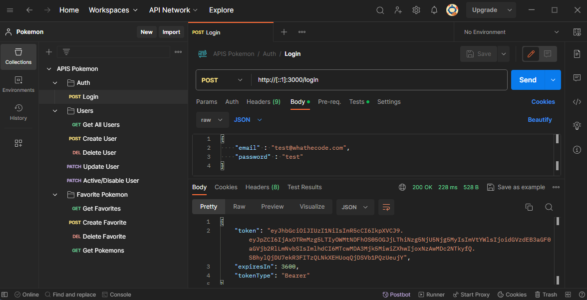
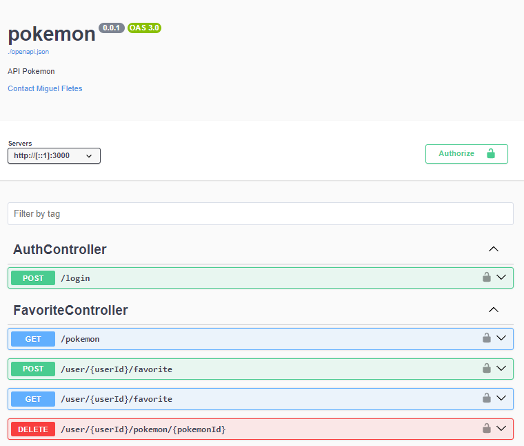
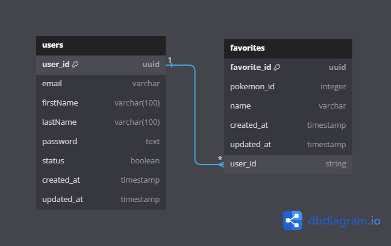

# Pokémon

[-@2x.png)](http://loopback.io/)


Esta aplicacion esta usando [LoopBack 4 CLI](https://loopback.io/doc/en/lb4/Command-line-interface.html) with the
[initial project layout](https://loopback.io/doc/en/lb4/Loopback-application-layout.html).

## Install dependencies

Por defecto, las dependencias se instalaron cuando se generó esta aplicación. 
Cada vez que las dependencias en `package.json` se modifican, ejecuta el siguiente comando::

```sh
npm install
```


## Para correr la aplicación se tiene que ejecutar este comando:

```sh
npm start
```

También puedes ejecutar `node` . para omitir el paso de construcción.

Al ejecutar la aplicación se crea el esquema de la base de datos y un usuario con el correo: `test@whathecode.com` y contraseña: `test`, la logica de esta funcion se encuentra en el archivo `/src/datasources/postgresql.datasource.ts`

Abre http://127.0.0.1:3000 en tu navegador.


## Seguridad en la API
Para consumir las APIs primero se tiene que utlizar el endpoint `/login` donde se tienen que eviar las credenciales (email y password) para que se pueda iniciar sesión por JWT, ese token se tiene que poner en las otras APIs por el metodo `Bearer Authentication`, en el caso que no se proporcione el token el recurso deniega la funcionalidad de la petición


## Ejecutar APIS via Postman
En el proyecto existe un archivo en el directorio `/postman/APIS Pokemon.postman_collection.json` el cual se puedo utilizar para importar ese archivo desde postman y empezar a consumir las APIS, en esa coleccion ya vienen configuradas las variables de entorno




## Ejecutar en el API Explorer
Lookback4 proporciona una herramienta para ejecutar las APIS la cual se pueden realizar en la siguiente ruta `http://localhost:3000/explorer/`




## Preguntas de la prueba

### ¿Cómo implementaste la relación entre el modelo de usuario y el modelo de favoritos?
Use la propiedad de entidades que tiene LoopBack4 donde se creo la entidad de `user` y `favorites` y se realizo una migración para los esquemas se crearan en la Base de datos, en cada Modelo de entidad se realizo la relación con decoradores "@hasMany" y "@belongsTo"


### ¿Qué consideraciones tuviste en cuenta para asegurarte de que un usuario solo pueda agregar o eliminar sus propios Pokémon favoritos?
Primero tener en cuanta que el usuario para poder agregar o eliminar debe estar logueado por JWT, el api de agregar o eliminar envía el id del usuario por parámetro pero se valida que el token corresponda al id que se recibe en la petición.

### ¿Si un usuario tiene muchos Pokémon en su lista de favoritos, ¿cómo mejorarías el rendimiento de las consultas para obtenerlos?
Se tendria que realizar una paginación a nivel base de datos donde en el api reciba un atributo "offset" y un "limit", además agregando un filtro de busqueda para ir filtrando los datos que solo requiere


## Base de datos
Se modelo la siguiente entidad relación el cual se tiene en los Modelos de LoopBack4 y se utiliza para guardar los datos del API




## Librerias Utilizadas

### Se utilizo como estandar de id uuid para evitar que los id sean enteros y por cuestion de seguridad de datos

```sh
npm install uuid
```

### Se utilizo para usar el archivo `.env` y usarlo para la conexión de la DB

```sh
npm install dotenv
```

## Comandos Utilizados para la creacón del proyecto
Instale el conector para postgresql:
```sh
npm install loopback-connector-postgresql --save
```

Posteriormente en la terminal cree un datasources para configurar postgresql con loopback4
```sh
lb4 datasource
```


Se crearon los modelos con el siguiente comando, los cuales son "users", "favorites"
```sh
lb4 model
```

Se crearon un repositorio por cada Modelo
```sh
lb4 repository
```

Posteriormente se crearon los controladores de "users", "favorites"
```sh
lb4 controller
```
 

Para construir el proyecto de forma incremental:

```sh
npm run build
```

Para forzar una construcción completa limpiando los artefactos en caché:

```sh
npm run rebuild
```


## JSON Web Tokens
Para la gestión de JSON Web Tokens se utilizo la libreria nativa de LoopBack4, el cual se puede consultar en su documentación oficial https://loopback.io/doc/en/lb4/Authentication-tutorial.html


